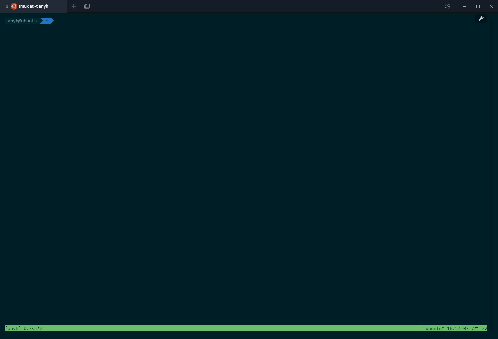

## marker
Marker is a CLI tools for Markdown, support remove useless images,
batch upload images to blog platform like cnblogs.

```
███╗░░░███╗░█████╗░██████╗░██╗░░██╗███████╗██████╗░
████╗░████║██╔══██╗██╔══██╗██║░██╔╝██╔════╝██╔══██╗
██╔████╔██║███████║██████╔╝█████═╝░█████╗░░██████╔╝
██║╚██╔╝██║██╔══██║██╔══██╗██╔═██╗░██╔══╝░░██╔══██╗
██║░╚═╝░██║██║░░██║██║░░██║██║░╚██╗███████╗██║░░██║
╚═╝░░░░░╚═╝╚═╝░░╚═╝╚═╝░░╚═╝╚═╝░░╚═╝╚══════╝╚═╝░░╚═╝

A Markdown Helper. Run marker -h to get useage.
```

## install

```shell
go install github.com/yahuian/marker@latest
```

## remove



marker 第一次运行时，会自动生成 ``$HOME/.marker.yaml`` 配置文件，其中可以配置要忽略的文件名（支持正则），以及要清理的图片类型。

执行 ``marker remove --root="path/to/your/file"`` 时，程序会扫描所指定路径下的所有未被忽略的文件，建立前缀树并解析所有 ``.md`` 文件中相对路径的图片（在线图片和绝对路径的图片会被忽略），计算各个图片被引用的次数，被引用次数小于一，且后缀满足 ``image_types`` 配置中指定的类型时，该图片会被打印显示。

增加 ``--yes`` 选项时，上述的文件会被直接删掉。

注意：本次演示的例子中有些图片是误报的，比如 css.png 没有在 Markdown 文件中引用，却在其他的文件中使用了，这种情况可以修改 ``skip_files`` 配置将其跳过。
