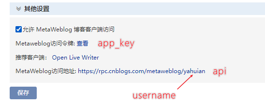
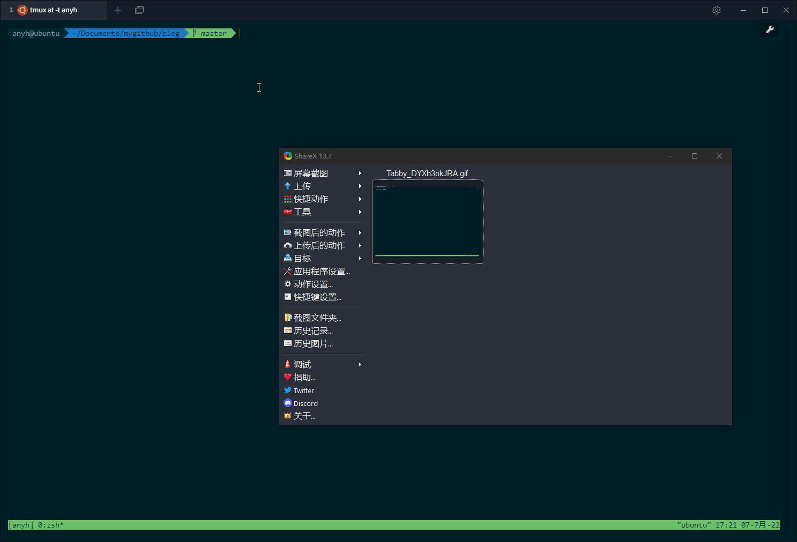

## marker
Marker is a CLI tools for Markdown, support remove useless images,
batch upload images to blog platform like cnblogs.

```
███╗░░░███╗░█████╗░██████╗░██╗░░██╗███████╗██████╗░
████╗░████║██╔══██╗██╔══██╗██║░██╔╝██╔════╝██╔══██╗
██╔████╔██║███████║██████╔╝█████═╝░█████╗░░██████╔╝
██║╚██╔╝██║██╔══██║██╔══██╗██╔═██╗░██╔══╝░░██╔══██╗
██║░╚═╝░██║██║░░██║██║░░██║██║░╚██╗███████╗██║░░██║
╚═╝░░░░░╚═╝╚═╝░░╚═╝╚═╝░░╚═╝╚═╝░░╚═╝╚══════╝╚═╝░░╚═╝

A Markdown Helper. Run marker -h to get useage.
```

## install

```shell
go install github.com/yahuian/marker@latest
```

## remove


marker 第一次运行时，会自动生成 ``$HOME/.marker.yaml`` 配置文件，其中可以配置要忽略的文件名（支持正则），以及要清理的图片类型。

执行 ``marker --root="path/to/your/file" remove`` 时，程序会扫描指定路径下的所有未被忽略的文件，并解析所有 ``.md`` 文件中相对路径的图片。

在计算完各个图片被引用的次数后，被引用次数小于一，且后缀满足 ``image_types`` 配置中指定的类型时，该图片会被打印显示。

增加 ``--yes`` 选项时，上述的文件会被直接删掉。

**注意**：本次演示的例子中有些图片是误报的，比如 css.png 虽然没有在 ``.md`` 文件中引用，却在其他的文件中使用了，这种情况可以修改 ``skip_files`` 配置将其跳过。

## upload

首先在你的博客园 https://i.cnblogs.com/settings 设置**允许 MetaWeblog 博客客户端访问**，并生成个人令牌 app_key，填入 ``$HOME/.marker.yaml`` 配置中。

其中 blog_id 可以为空，kind 不要修改。




然后执行 ``marker upload`` 就会将你本地的图片批量上传到博客园，并且替换掉图片地址后生成一份新的 Markdown 文件，然后你就可以复制这份文件去博客园后台发文了。



## 相关文章

https://www.cnblogs.com/yahuian/p/marker.html